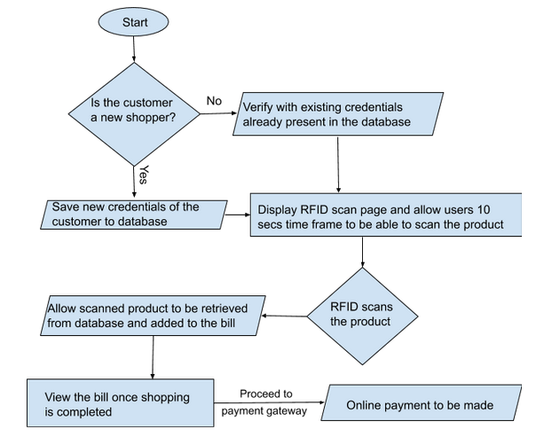

# Smart Trolley

> IoT-based android application to ease the shopper's experience in retail stores and marts

## Problem statement

Shopping tops the list of activities millennials engage in. Shopping malls and retail stores have witnessed a surge in customers over the past decade. Long queues at the counter and security checks can make shopping quite cumbersome and time-consuming.

## Solution

This application aims to provide a technology oriented, low-cost system to assist the shopper. The shopper is offered access to the various products in the store by category. This is enabled by a user-friendly mobile application linked to the store’s database(products). 
Every customer is assigned a unique ID as he/she enters the store, which will then be detagged on exit. On scanning the RFID associated with a product, it is added to the respective cart whose prices are then summed up automatically.
At the exit, the total amount can either be paid online or in cash without much delay. A tally between purchased items and the database ensures security.

## Methodology

